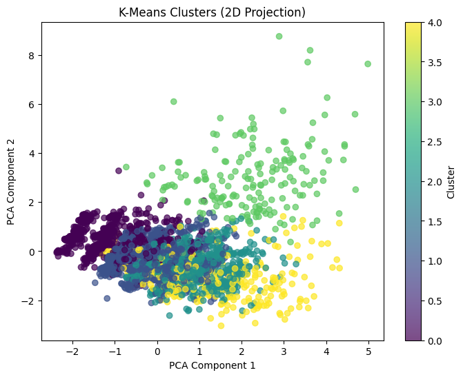

# Student-Dropout-Prediction-ml
A machine learning project focused on analyzing student data to identify academic patterns and predict dropout risk using data-driven techniques.

## Overview
Student dropout is a major challenge in higher education.
This project analyzes a real-world student dataset to understand academic performance, demographic factors, and socio-economic indicators, and applies machine learning techniques to predict student dropout risk.

The objective is not only prediction, but also gaining insights that can help institutions identify at-risk students early.

## Dataset
Records: 4,400+ students
Features: 35 academic, demographic, and socio-economic attributes
Target Classes: Dropout, Graduate, Enrolled

## Data Preprocessing
- Steps applied to prepare data for modeling:
- Label encoding of categorical features.
- Feature scaling using StandardScaler.
- Outlier removal using IQR method.
- Feature engineering (average grades, approvals, evaluations).
- Feature selection for improved performance.

## Exploratory Data Analysis (EDA)
The following insights were derived using visual analysis:
Distribution of student outcomes
Age and gender trends
Course-wise dropout patterns
Semester-wise performance consistency

## Machine Learning Models
Classification (Dropout Prediction)
Models used:
- Random Forest Classifier
- Logistic Regression
- Best Accuracy Achieved: ~83%

## Clustering (Student Segmentation)

- K-Means Clustering
- Hierarchical (Agglomerative) Clustering
- PCA used for 2D visualization

### Regression (Performance Prediction)

- Built Linear Regression and Polynomial Regression models to predict a final academic performance index.
- Engineered a performance score using semester-wise grades and approved curricular units.
- Evaluated models using R² score and RMSE to measure prediction accuracy.
- Compared linear vs polynomial models to analyze non-linear relationships in academic performance.

